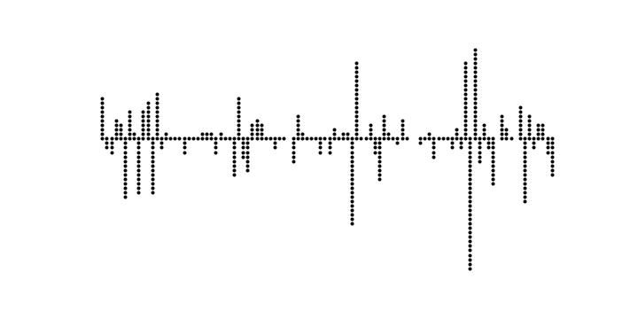
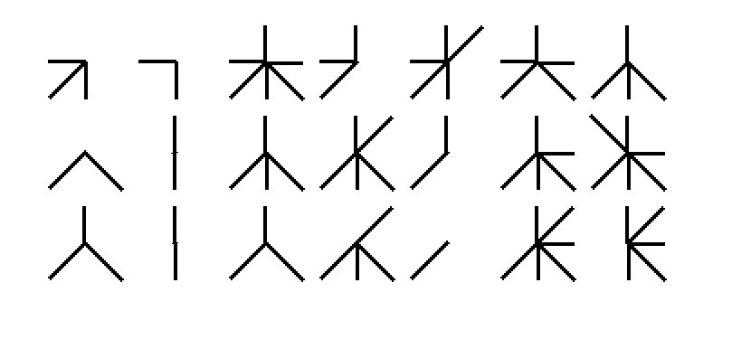

# Tatto Data Project

This project aims to build a symbolic representation of sounds to be used as a tattoo sensor for human skin

Prototype nb: <a href='./sound_v1.ipynb'>./sound_v1.ipynb</a>

</img>

Symbolic binary representation (8-bits): 

</img>
